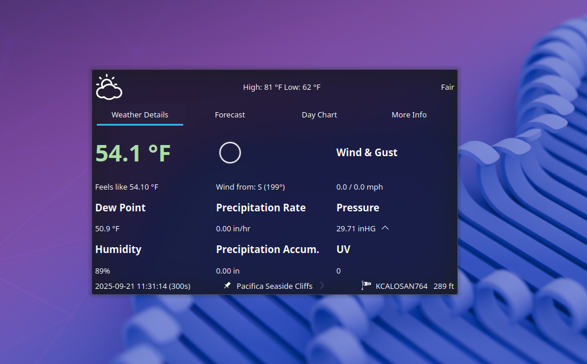
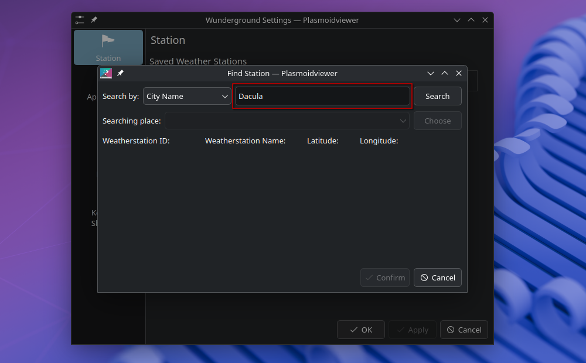
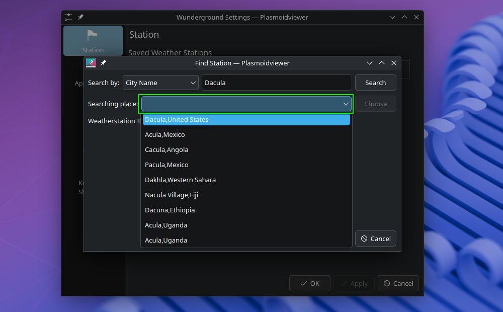

# Wunderground PWS Widget for KDE 6

A Plasma 6 widget for showing weather from Wunderground Personal Weather Stations (PWS).

PWS is a network of [250,000+](https://www.wunderground.com/pws/overview) weather stations that offer local and timely weather conditions. Rather than traditional sources which average data across areas, you can know exactly what the conditions are within a small (many times less than 1km) radius. Furthermore, the stations offer more timely (every 5 minutes) reporting than most sources. This widget includes those local conditions as well as forecasts, alerts, air quality, and additional info for your area.

## Installing

Install at the [KDE Store](https://store.kde.org/p/2135799) or your distribution's package manager if it carries plasma widgets (ie. [Discover](https://apps.kde.org/discover/)[^1]).

## Configuring

This widget relies on local stations (ie. [KGADACUL1](https://www.wunderground.com/dashboard/pws/KGADACUL1)). You can get an overview of stations in your area at [`wunderground.com/wundermap`](https://wunderground.com/wundermap). Do not worry if you don't know any or you cannot access that site! The widget allows you to search by your area name or coordinates.

Once installed, click `Configure Wunderground` or right-click and hit the slider icon. Then, under `Station`, click `Find Station`.

### Search by city/area

To search by your city/area, enter that name into the first search box next to the `Search` button. Then, click `Search`. Next, choose the full name of your area with the dropdown box next to the `Choose` button. Click `Choose`. Due to API restrictions, this must be split into two parts.

  
See steps

  #### Step 1

  Type the area name into the red search bar and click `Search`.

  

  #### Step 2

  That search has populated the green dropdown box with matches for that area name. Select the correct one and the click `Choose`.

  

### Search by coordinates

To search by coordinates, choose `Lat/Lon` in the `Search by:` dropdown box. Enter WGS84 geocode coordinates and hit `Search`.

### Search by station ID

If you know your/a station's ID. Choose `Weatherstation ID:` in the `Search by:` dropdown box. Enter the station's ID and hit `Search`.

### Selecting a station

In the search popup, hit the `Select` button next to the desired station. Once selected, hit `✓Confirm` to add it to the main config page's list. It will be automatically selected and `Apply` the settings to change the station. You can change your selection by hitting the `✓` icon next to any of the saved stations and `Apply` the settings to take effect.

### Removing Stations

In the list under the `Station` config page, select the `X` icon to remove that station from the list of saved stations.

### Advanced Manual Add

If you know the station ID and do not want to click through extra steps, hit `+ Manual Add`, enter the case-sensitive station ID, and confirm. The station will be on the list and you should be good to go!

### Units

Units and time format are fully customizable.

## Translating

Translations are welcome!

Follow the file in [plasmoid/translate](./plasmoid/translate) for directions or feel free to contact me!

## Meta

Big thanks to [@bluxart](https://x.com/bluxart) and [@pyconic](https://x.com/pyconic) for Meteocons the free [icons](https://www.alessioatzeni.com/meteocons/).

Big thanks to [Zren](https://github.com/Zren) for files from [`applet-lib`](https://github.com/Zren/plasma-applet-lib/) and [`applet-simpleweather`](https://github.com/Zren/plasma-applet-simpleweather/).

Upstream changes have also been merged back in from rliwoch's [`plasmoid-wunderground-extended`](https://github.com/rliwoch/plasmoid-wunderground-extended).

Portions of [CompactRepresentation](./plasmoid/contents/ui/CompactRepresentation.qml) and [IconAndTextItem](./plasmoid/contents/ui/IconAndTextItem.qml) are from `org.kde.plasma.weather`.

The text coloring utilities are thanks to @Gojir4 on the QML forum.

### Known Problems

Qt 6.10: Widget version 3.5.3 is required.

Text coloring for dark/transparent themes is currently buggy in Plasma 6. The first time a widget loads the text may not be colored correctly.

Changing the transparency then back again seems to solve this issue. See [#58](https://github.com/k-donn/plasmoid-wunderground/issues/58).
Under Appearance in the widget settings, toggle "Show Background."

The legacy forecast API is geolocation locked in some cases. The newer API is not, but it does not provide all of the same attributes. Checking `Use Legacy Forecast API:` under `Debug` in settings reverts the widget to use the legacy API. Then, you then get the snow, thunder, and golf forecast.

If you are getting lots of `Setting initial properties failed: <COMPONENT> does not have a property called cfg_XXXX` that is a known [Plasma bug](https://bugs.kde.org/show_bug.cgi?id=494417) and does not affect the widget.

## TODO

- i18n
  -   [ ] Translations for new text
- Customizability
  -   [ ] Choose what to show in panel and desktop forms
  -   [ ] Widget size/padding/scaling
- Backend
  -   [x] Improve searching and testing error messages
  -   [ ] Better handle null fields
- Parking lot
  -   [ ] Search by map feature
  -   [ ] Use Wunderground Plasma Ion.

[^1]: Discover sometimes has difficulties getting the most recent version.
